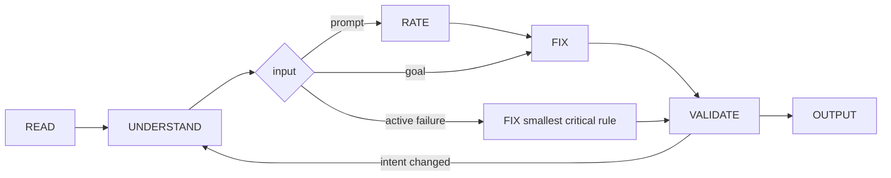

# Octocode prompt optimizer

tools: `npx octocode` / `octocode-mcp`
related-skill: `octocode-eval-benchmark`
output: `<workspace>/.octocode/` for workspace work | `<home>/.octocode/` when no workspace applies
routes: load a reference only when it changes the next action; otherwise keep the rule here.

Optimize the instruction surface the runtime reads, not nearby prose. Trace `source → assembly/serialization → model or tool reader → observable action`, then change the smallest owning layer.

A goal skips RATE. An active safety, permission, or production failure is contained first; broader work then returns to RATE. Urgency never expands authority, permits a partial read, or skips VALIDATE.

## When → Load

| When | Load |
|---|---|
| Start: READ, UNDERSTAND, RATE | `references/flow/understand-rate.md` |
| A host, loader, middleware, or graph assembles the context | `references/flow/runtime-context.md` |
| FIX: repair order, change note, critical-rule pattern | `references/flow/fix.md` |
| A rule leaves the action unclear; instructions conflict | `references/writing/rules.md` |
| Text is wordy, buried, or mixes instructions with data | `references/writing/style.md` |
| A specific failure mode needs a technique | `references/writing/prompt-techniques.md` |
| VALIDATE and OUTPUT | `references/flow/validate-output.md` |
| MCP instructions, descriptions, schemas / MCP wire / multi-tool audit | `references/tools/tool-contracts.md` / `references/tools/mcp-wire-contract.md` / `references/tools/contract-audit.md` |
| Delegation / cross-app payload / Zod packet / frozen base prompt | `references/agents/agent-communication.md` / `references/agents/cross-app-contracts.md` / `references/agents/zod-agent-contracts.md` / `references/agents/agent-prompt-integrity.md` |
| Context may overflow / must shrink / cost proof / cache misses | `references/context/context-budget.md` / `references/context/compaction.md` / `references/context/token-economics.md` / `references/context/prompt-caching.md` |
| Instructions consume retrieved, tool, or user text | `references/context/untrusted-content.md` |
| Typed judgment or semantic location in unread files | `octocode-research` clasify gate; verify deciding source |
| A reliability claim needs proof, or this skill changes | `octocode-eval-benchmark` |

Related: `octocode-skills` owns skill-folder review; `octocode-research` owns MCP/CLI verification; `octocode-subagent` owns delegation topology; `octocode-documentation` (`style-ste80`) owns the STE-80 profile; `octocode-clean-agentic-code` owns intent-preserving sweeps of dated instruction cruft.

## Rules

- Read the complete input and map its intent before you judge it; rate evidenced issues before you draft fixes.
- Prove the executing surface and effective context path before you count or rewrite context; a manifest, source file, or installed copy does not prove what the active process reads.
- Combine adjacent phases only for short, low-risk text. Always validate the finished draft.
- Make every rule decide an observable action, with one owner per behavior. Be explicit enough that a colleague with no context can follow it, and give the reason when a constraint is not obvious ([Anthropic](https://platform.claude.com/docs/en/build-with-claude/prompt-engineering/claude-prompting-best-practices)).
- Start minimal; add an instruction only for an observed failure ([Anthropic](https://www.anthropic.com/engineering/effective-context-engineering-for-ai-agents)). Maximize behavior per token, not brevity; justify growth by the boundary it adds.
- Write rewritten instructions in STE-80 (ASD-STE100 rules): one instruction per sentence, active voice, imperative steps, one term per concept. Write flows and routing as Mermaid source or an arrow chain, not dense prose.
- Treat context capacity, token billing, cache reuse, and prompt integrity as separate constraints.
- Preserve intent, working branches, identifiers, commands, and required metadata; verify technical claims before you rewrite them.
- Reserve firm language for real requirements; never use capitals, threats, or rewards for emphasis.
- Mutate files only when authorized; otherwise return a delta. When the request is for prompt text, output only that text.
- Ask one focused question only when an unresolved choice changes intent, scope, or risk. Report unmeasured reliability claims as unmeasured.

Reviews and drafts go to `<output>/octocode-prompt-optimizer/`; scratch to `<output>/tmp/octocode-prompt-optimizer/`. Chat-only deltas stay in chat.

## Done

This skill ships no scripts. Report only checks you ran; the deliverable, score, changed files, and deferrals must match reality.
