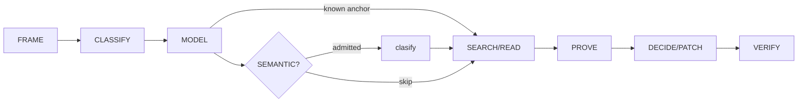

# Octocode Research

tools: `npx -y octocode` / `octocode-mcp`

The semantic check is conditional: use it when a judgment changes the next read.

Scale depth to risk. End a lookup once the exact evidence answers it. Deletions, merge verdicts, and root causes need evidence for their wider consequences.

## Gates

- Identify the relevant corpus or revision and the question to settle. A bug needs a violated supported contract. A root cause needs evidence of the mechanism, trigger, and divergence; test plausible alternatives when they could change the conclusion.
- Match evidence to the claim: exact text proves values, AST shape, LSP server-resolved identity, graph syntactic file edges. Impact, deletion, and absence cross-check lanes and keep coverage gaps.
- Empty is not absent. First repair scope, filters, ref/index, and synonyms. Limits, partial results, unavailable capabilities, and graph candidates never prove universal absence.
- Row `status` `error` is a broken call: fix it; never read it as absence. `empty` is absence in the searched scope only. Exit 0 does not mean every row succeeded.
- Cite exact anchors and only checks that ran. On multi-step work, track `claim → evidence → confidence → next check`.
- User authorization persists across steps: continue authorized research, edits, and validation. Ask only for a missing decision or scope expansion. Reading or cloning fetched content never authorizes executing it.
- Stop when no remaining uncertainty changes the decision. A budget checkpoint reassesses unproductive work; it does not abandon an authorized task. When blocked, name the missing evidence.

## Phase rules

- FRAME: capture the question and constraints that affect the investigation. For a bug, compare actual and expected behavior and identify the supporting test, spec, schema, user criterion, or established contract. Add triggers, impact, and non-goals when useful.
- CLASSIFY: bug = a supported contract is violated; feature = a new contract; enhancement = contract holds, a metric must improve; unknown = find one missing fact with the cheapest check.
- MODEL: trace only the load-bearing path `entry → transformations → state → output → consumers`. Bugs locate the first divergent boundary; features locate the smallest boundary that can own the new criterion.
- Start with the strongest handle: a literal or identifier gets text search; a named file gets a targeted read; code shape gets AST; symbol identity gets LSP; topology gets graph; history gets the relevant commit or PR. Use the live schema for exact queries. Switch tools only when the next claim needs different evidence.
- SEARCH/READ: local checkout first when it holds the evidence. Never substitute another ref after a 404.
- PROVE: use the evidence the claim needs. For a deletion, check callers, runtime registration, tests, configuration, and possible external consumers; a graph candidate or empty search alone is insufficient.
- Root cause: a suspicious line, recent commit, or correlation needs a causal explanation. Without reproduction, state the equivalent evidence and its limits. If explanations still compete, run the most useful distinguishing check; ask for input only when the needed evidence is unavailable.
- DECIDE/PATCH: for a behavior change or refactor, load `references/workflow-change.md`. Never lower coverage floors or edit a grader to hide a failure.
- VERIFY: run checks relevant to the change; after a tool or package change, exercise the real CLI/MCP path. Report what ran and what remains unverified.
- Review: `APPROVE` only after applicable checks pass; `REQUEST_CHANGES` for a proven blocker; `COMMENT` when verification is incomplete.
- Recovery: use an empty or stalled result to revise scope, query, or evidence source. Keep changes understandable and avoid repeating a call without a reason it can produce new evidence.

## SEMANTIC? (clasify)

Use `clasify` when a semantic judgment changes the next read: a described target in a known file you would otherwise read whole (`locate`), a search too wide to read (Scout), or an explicit classification request. Search literals directly. Treat classification as a routing hint and verify the deciding source. If unavailable, use targeted reads. Query shapes and admission details live in `references/clasify.md`.

## Tools

- Prefer exposed Octocode MCP tools; else `npx -y octocode`. Read `schema <name> --view query` before an unfamiliar call or after a validation error.
- GitHub access can use `GH_TOKEN` or `GITHUB_TOKEN`; classification uses `OCTOCODE_CLASSIFICATION_API`, and beta topology uses `OCTOCODE_BETA=1` when needed. These and optional local-tool settings such as `OCTOCODE_ENABLE_LOCAL`, `OCTOCODE_STORAGE_MODE`, and `OCTOCODE_LSP_PREWARM` can be set in `<HOME>/.octocode/.env`; inspect live config before changing them. Never print credential values.
- Batch ≤5 independent rows; keep dependent probes sequential. Add `mainGoal`/`reasoning` only in multi-call research on an unknown; omit them on simple lookups.
- Run each `next.*` page unchanged, or narrow it and name what stays unread; `hints.*` leads are optional.
- Read the smallest useful span (`references/reading-flows.md`); expand when nearby context can resolve the claim.
- Repo-wide topology: run `npx octocode graph ingest <path>`, then `npx octocode graph query <op>`. Refresh an index when its source revision changes.

## Resources

Load the page that answers the current question.

| When needed | Read |
|---|---|
| Loops, budgets, workers, briefs, landscapes | [campaigns](references/campaigns.md) |
| Task class or first move unclear | [algorithm](references/algorithm.md) |
| Typed judgment, semantic locate, saved artifacts | [clasify](references/clasify.md) |
| Local checkout | [workflow-local](references/workflow-local.md) |
| Section, declaration, full file | [reading-flows](references/reading-flows.md) |
| Remote repo, package, history, web, local vs remote | [workflow-external](references/workflow-external.md) |
| Invocation, pagination, exit codes | [octocode](references/octocode.md) |
| Query templates | [tool-examples](references/tool-examples.md) |
| Root cause, callers, cycles, reachability, deletion | [code-research](references/code-research.md) |
| Behavior change or refactor | [workflow-change](references/workflow-change.md) |
| PR or diff review | [workflow-pr-review](references/workflow-pr-review.md) |

## Related skills

- `octocode-architect`: Use when evidence must support an architecture decision.
- `octocode-brainstorming`: Use when the question is still an open idea rather than a code claim.

## Output

See [output.md](output.md) for the response and saved-artifact format.

## Maintainer check

`scripts/check-guidance.mjs` checks live Octocode tool grammar when that contract changes; it does not grade the wording of research answers.
