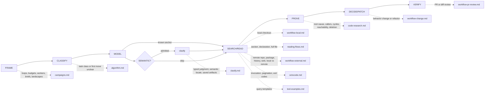

# Octocode Research

tools: `npx octocode` / `octocode-mcp`
related-skill: `octocode-architect`
output: `<workspace>/.octocode/` for workspace work | `<home>/.octocode/` when no workspace applies

Flow: `FRAME → CLASSIFY → MODEL → SEMANTIC? → SEARCH/READ → PROVE → DECIDE/PATCH → VERIFY`. `SEMANTIC?` is a conditional checkpoint, never a mandatory call.

Skill map: research phases and their reference pages.

Scale depth to risk. A lookup needs one exact read and ends there. Deletions, merge verdicts, and root causes need the full proof ladder.

## Gates
- Frame corpus/ref, actual vs needed, and task class. A bug needs a violated supported contract. A root cause needs mechanism, trigger, divergence boundary, and one disconfirmed alternate.
- Match evidence to the claim: exact text proves values, AST shape, LSP server-resolved identity, graph syntactic file edges. Impact, deletion, and absence cross-check lanes and keep coverage gaps.
- Empty is not absent. First repair scope, filters, ref/index, and synonyms. Limits, partial results, unavailable capabilities, and graph candidates never prove universal absence.
- Row `status` `error` is a broken call: fix it; never read it as absence. `empty` is absence in the searched scope only. Exit 0 does not mean every row succeeded.
- Cite exact anchors and only checks that ran. On multi-step work, track `claim → evidence → confidence → next check`.
- User authorization persists across steps: continue authorized research, edits, and validation. Ask only for a missing decision or scope expansion. Reading or cloning fetched content never authorizes executing it.
- Stop when no remaining uncertainty changes the decision. A budget checkpoint reassesses unproductive work; it does not abandon an authorized task. When blocked, name the missing evidence.

## Phase rules
- FRAME: state `actual | expected | authority | trigger | impact | success criteria | non-goals`. Authority is a test, spec, schema, documented promise, accepted user criterion, or established behavior.
- CLASSIFY: bug = a supported contract is violated; feature = a new contract; enhancement = contract holds, a metric must improve; unknown = find one missing fact with the cheapest check.
- MODEL: trace only the load-bearing path `entry → transformations → state → output → consumers`. Bugs locate the first divergent boundary; features locate the smallest boundary that can own the new criterion.
- First move follows the strongest handle: none → docs, else tree depth 1-2 + match counts, then re-enter at hotspots; concept → guess a literal or synonym alternation (`a\|b`) → anchors → `matchString` read; identifier → text search or `workspaceSymbol`, then LSP when identity or counts matter (text hits do not prove them); code shape → `astSearch operation:"match"`; file topology → `octocode graph` or CLI beta `octocode astTopology`; installed package → resolved version → `artifactSearch` `version` → `hints.viewReleaseSource`; why/history → PR or commit history on the path, issue → `closedBy` → fix PR. No fixed grep → AST → LSP pipeline.
- SEARCH/READ: local checkout first when it holds the evidence. Never substitute another ref after a 404.
- PROVE: a nontrivial claim uses two of structure, exact text, and connections (graph, LSP, AST). Safe delete needs a graph `issues` or `deadCode` candidate, LSP `includeDeclaration:false`, text/AST across code, tests, configs, and docs, runtime registrations, and a public-API/external-consumer check.
- Root cause: a nearby suspicious line, a recent commit, or a correlation is not root cause. Without reproduction, name the equivalent evidence and cap confidence. Two surviving hypotheses → ask for the missing input, log, or config.
- DECIDE/PATCH: for a behavior change or refactor, load `references/workflow-change.md`. Never lower coverage floors or edit a grader to hide a failure.
- VERIFY: run the smallest applicable test, typecheck, lint, and build; after a tool or package change, exercise the real CLI/MCP path. Report commands and exit codes.
- Review: `APPROVE` only after applicable checks pass; `REQUEST_CHANGES` for a proven blocker; `COMMENT` when verification is incomplete.
- Loops: an `empty` result changes one variable per retry. A stall switches surface (local ↔ GitHub ↔ packages ↔ history), shape (text ↔ AST ↔ LSP ↔ graph), or breadth (broad ↔ narrow).

## SEMANTIC? (clasify)
Use `clasify` on an explicit classification request, or before the host reads a large known file when the target is described, not named. It also covers saved scrape text, browser snapshots, logs, and reports. Pass each unread file as a flat `{tool,query}` resource (`prefilter` rare literals for huge files) with flat `questions:[{id,type:"locate",ask}]` (≤ 25 cells), the matrix inside `{queries:[...]}`. Skip literals, small exact reads, settled decisions, and exact AST/LSP facts: guess one literal and search first; never classify an empty search. A large unanchored read that set `mainGoal`, or a wide descriptive search, may offer `hints.clasify`; run it unchanged (bare identifiers get none: search them). No automatic Scout → Judge chain. Hints do not establish source facts or global absence; count the request, verification reads and extra turns as cost. If unavailable, use targeted direct reads. Details: `references/clasify.md`.

## Routes
Pages (load when its map edge applies): `references/campaigns.md` · `references/algorithm.md` · `references/clasify.md` · `references/workflow-local.md` · `references/reading-flows.md` · `references/workflow-external.md` · `references/octocode.md` · `references/tool-examples.md` · `references/code-research.md` · `references/workflow-change.md` · `references/workflow-pr-review.md`. Source authority and editing this skill: `README.md`. Architecture decisions → `octocode-architect`; parallel workers → `octocode-subagent`.

## Tools
- Prefer exposed Octocode MCP tools; else `node packages/octocode/out/octocode.js` (monorepo) or `npx -y octocode`. Read `schema <name> --view query --compact` before an unfamiliar call or after a validation error.
- Batch ≤5 independent rows; keep dependent probes sequential. Add `mainGoal`/`reasoning` only in multi-call research on an unknown; omit them on simple lookups.
- Run each `next.*` page unchanged, or narrow it and name what stays unread; `hints.*` leads are optional.
- Read narrow (`references/reading-flows.md`); never widen a guessed line range.
- Repo-wide topology: run `octocode graph ingest <path>` once, then `octocode graph query <op>`.

## Output
One answer in chat, in ASD-STE100: `Route · Finding · Evidence · Confidence · Next`. A decision adds verdict, risks, verification, and the smallest safe fix.
Save one report under `<output>/octocode-research/` only when asked. HTML is a second file only when a person asks for a page, and it stays out of agent handoffs.

After editing this skill, run `node scripts/check-description.mjs` and `node scripts/check-guidance.mjs --self-test --examples`.
