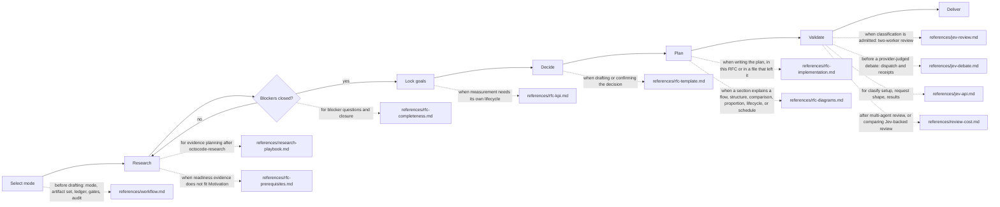

# Octocode RFC Generator

tools: `npx octocode` / `octocode-mcp`
related-skill: `octocode-research`
output: `<workspace>/.octocode/` for workspace work | `<home>/.octocode/` when no workspace applies

Produce evidence-backed decisions and plans that builders and reviewers can execute.

Caption: research repeats until blockers close; lock goals before the recommendation.
To reassess an existing RFC, use the audit route in `references/workflow.md`.

## Lobby rules
- Compare the viable alternatives. Include the status quo when it is a real option. Skip options that cannot satisfy the decision.
- Base recommendations on verifiable facts; `octocode-research` owns citation and evidence rules.
- `RFC.md` owns the decision and, when there are steps, the plan. `PLAN.md` is only a settled decision with no RFC. A linked file points at the primary document and does not restate it.
- During research, record the comparison under Rationale and Alternatives with `Comparison outcome: unresolved`. Keep a reversal condition beside each option. Eliminate an option only with evidence that it violates a fixed constraint.
- Do not set `Recommendation: final` until decision-blocking questions close with evidence and Goals and Non-Goals are locked. Mark other uncertainty with confidence, impact, owner, and a proof trigger or a deferral trigger.
- Show structure as mermaid diagrams, not paragraphs: decisions, flows, comparisons, proportions, lifecycles, and step dependencies. Give each diagram one caption line. Required facts also stay in text or tables.
- Write the acceptance contract before implementation steps. Order steps by dependency, not estimates. Link every step to acceptance and verification.
- Chat and saved files use the headings in `references/rfc-template.md` and `references/rfc-implementation.md`. Do not rename a heading in the delivery summary.
- Reassessing `.octocode/rfc/` requires fresh reads of live code and a dated audit result. The audit block is the only append-only exception to an accepted RFC's freeze. Write it only with source-edit authority; otherwise return it in chat.
- Never assert RFC status from memory or from another RFC's claims.
- Stop (and ask one focused question when an answer unblocks the work) when: the work is a trivial edit; a brainstorming handoff is not RFC-ready; uncertainty changes artifact shape, owner, scope, or tradeoff priority; another research pass is unlikely to close a blocker; independent decisions need separate RFCs; or a requested action lacks authority. Continue independent authorized work while a specific question stays open.

## Output
One document: the answer in chat, or one `RFC.md` at `<output>/rfc/{name}/RFC.md` when a save is authorized. Put the plan in that same file, after Unresolved Questions.
Add a second file only when that part has its own lifecycle: `PLAN.md` for a settled decision, `IMPLEMENTATION.md` when the build leaves the RFC, `KPI.md` for a separate measurement contract, `PREREQUISITES.md` for readiness evidence, `RESOURCES.md` for a source inventory, or `review/` after a two-agent review.
Use the headings in `references/rfc-template.md`. A plan uses the headings in `references/rfc-implementation.md`. Scratch stays in `<output>/tmp/octocode-rfc-generator/`. Approved source edits keep their paths.
A blocked Draft keeps `Recommendation: none` and `Comparison outcome: unresolved`. A ready RFC sets both to `final` and sets Decision blockers to `none` or `resolved`.

## Classification
Use ordinary evidence review by default. The `octocode-research` clasify gate owns classification admission. No RFC debate recipe overrides its benefit gate. A judgment never closes a blocker by itself.

## Related skills and authority
- Use `octocode-brainstorming` before RFC when worth-building is unresolved. Use `octocode-architect` for the structural evidence an option needs; this skill records and reviews the decision. Once accepted, an ADR summary belongs to `octocode-documentation`. Use `octocode-eval-benchmark` for KPI rigor. `octocode-research` owns the MCP/CLI workflow for factual questions.
- Use `octocode-skills` when changing this skill folder. Collection-wide review supports structural hygiene claims only. Claim behavioral superiority only against another workflow on the same frozen cases, budget, and independent grader.
- Reuse existing session authority for scoped saves and edits; do not ask again. Ask only for missing information or authority for a new effect.
- Saving a Draft, accepting its decision, and authorizing implementation are distinct. A review-only or chat-only request does not authorize source edits.

## Scripts (run from this skill folder; report the real result)
- Before delivery, run `node scripts/validate-rfc.mjs <file-or-folder>` for readiness checks.
- For an investigative Draft, run `node scripts/validate-rfc.mjs --draft <file-or-folder>`. It requires `Status: Draft`, `Recommendation: none`, `Comparison outcome: unresolved`, complete blocker fields, and no common covert commitment language. It reports `reviewReady:false`.
- `validate-rfc.mjs` also rejects unknown mermaid types and warns when `RFC.md` has no diagram. Its bounded lint cannot prove prose truth, evidence, or authority; inspect those separately. For chat-only output, apply the same checks manually.
- Before submitting a two-agent assessment packet, run `node scripts/validate-debate.mjs request.json worker-packet.json`. It requires a `{queries:[matrix]}` request with one source-free resource, a frozen admission gate, and distinct result-dependent actions. A failed preflight stops submission. A pass does not prove evidence truth or worker coverage.
- After a multi-agent or provider review, run `node scripts/validate-review-cost.mjs receipt.json`. Do not present provider-only usage as total cost.
- After a saved RFC set passes validation, run `node scripts/render-rfc.mjs <rfc-folder>`. It builds one HTML page from `assets/rfc-viewer.html` and `assets/rfc-viewer.js` and opens it in the browser. Each file is a page, with search, section TOC, and rendered mermaid. Report the printed path. Use `--no-open` in headless runs; re-run after edits.
- When changing a validator, the viewer, or the debate protocol, run its `--self-test`.
