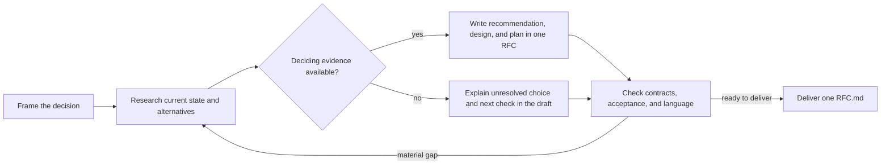

# Octocode RFC Generator

Produce one self-contained RFC that explains the decision and how to carry it out.

## One document

For an RFC task, keep the decision, prerequisites, implementation sequence, success criteria, rollback, open questions, and citations in **one Markdown file**. Default to `RFC.md` in the requested or established RFC location. Do not generate companion plan, KPI, resource, prerequisite, audit, or receipt files. Link existing source code and authoritative documentation instead of copying them. Create another deliverable only when the user explicitly requests it.

One file gives reviewers a continuous argument and one diff to discuss; it keeps acceptance criteria beside the design and prevents competing copies of the plan. Use sections and anchors to navigate a long RFC. A standalone plan request can produce one plan document without inventing an open decision.

## Research and decide

- Establish the problem, users, goals, constraints, and current behavior. Verify deciding facts through `octocode-research`.
- Compare viable alternatives, including the status quo when useful. Explain the tradeoffs and what evidence could reverse the recommendation.
- Keep unresolved decisions explicit. A draft can propose a direction with open questions; present it as final only when deciding blockers close. Acceptance requires the owner's actual decision.
- Define observable success before implementation steps. Order steps by their dependencies and connect them to checks, compatibility, rollout, and rollback where relevant.
- Use examples and Mermaid when they clarify behavior, boundaries, or sequencing. Keep essential meaning in the text.
- Preserve accepted decision history when auditing an existing RFC. Report substantive discrepancies and remaining work without adding a research diary.

## Structure and language

Use [output.md](output.md) for the suggested structure and writing rules. Lead with the proposal, explain its practical effect, then supply the design and tradeoffs needed to judge it. Adapt section depth to the decision; omit empty sections and ceremonial fields.

Use plain, precise technical language. Separate existing behavior, proposed behavior, evidence, and unresolved assumptions. The RFC contains decision content and citations only: no probe output, tool transcripts, worker rosters, generated metadata, or review receipts.

The structure draws on the [Rust RFC template](https://github.com/rust-lang/rfcs/blob/main/0000-template.md), whose proposal, design, alternatives, and unresolved questions help reviewers evaluate a change. The [RFC Editor's style guidance](https://www.rfc-editor.org/authors/rfc-style-guide/) supports clear, concise, consistent wording. This is a repository proposal format; formal publication headers are unnecessary here.

## Verify and deliver

Check the proposal against current sources, implementation dependencies, acceptance criteria, and relevant project checks. Use `octocode-documentation` for language and readability. Report material gaps in plain language; keep diagnostic records outside the deliverable. Reuse the user's authorization for scoped saves and edits. Writing an RFC does not itself authorize implementation.

## Resources

| When needed | Read |
|---|---|
| Choose the mode, review dependencies, or audit an existing RFC | [workflow](references/workflow.md) |
| Plan deciding evidence and source selection | [research playbook](references/research-playbook.md) |
| Find questions that can block the decision or execution | [completeness](references/rfc-completeness.md) |
| Choose a diagram that explains the design | [diagrams](references/rfc-diagrams.md) |
| A typed judgment could help resolve a remaining disagreement | [optional clasify tool review](references/clasify-review.md) |
| An explicitly requested HTML view of the RFC | [render-rfc.mjs](scripts/render-rfc.mjs), using [viewer shell](assets/rfc-viewer.html) and [viewer behavior](assets/rfc-viewer.js) |

## Related skills

- `octocode-research`: Verify option claims and current system behavior.
- `octocode-architect`: Analyze boundaries and structural tradeoffs before choosing.
- `octocode-brainstorming`: Explore directions when the issue or option space is still open.
- `octocode-documentation`: Refine RFC language or record a settled decision as an ADR.
- `octocode-eval-benchmark`: Design measurements when deciding claims need a comparison.

## Optional configuration

Ordinary evidence review needs no classification key. Optional classification uses `OCTOCODE_CLASSIFICATION_API` from `<HOME>/.octocode/.env`; inspect the live tool schema and check presence without displaying its value. A classification result is a lead to verify, not evidence that closes a blocker by itself.
