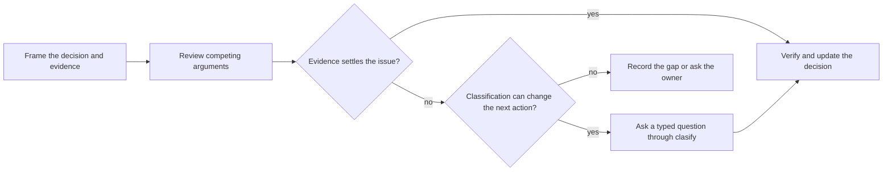

# Optional clasify tool review

Use the `clasify` tool when a consequential disagreement survives source review and a typed judgment could change the next action. Ordinary evidence review remains the default; `octocode-research` owns classification admission and current tool mechanics.

## Frame and review

Keep the RFC revision, decision criteria, source evidence, proposed answers, and material gaps together. Exact facts need a source or executable check; owner preferences need the owner's decision.

When delegation is authorized and independent review helps, give reviewers the same evidence and different useful questions. Keep write authority and final judgment with the primary agent. Collect initial positions before sharing replies, then focus any exchange on the remaining disagreement. Preserve dissent and partial returns; agreement is not independent proof.

## Optional judgment

Inspect `npx octocode schema clasify --view query` before forming the request. Classification needs `OCTOCODE_CLASSIFICATION_API`, configurable in `<HOME>/.octocode/.env`; check presence without displaying credentials.

Use the live schema to submit typed questions over the exact evidence and competing arguments. Include an uncertainty outcome where needed. Record the intended next action before the call so its contribution can be assessed. Run a direct check instead when it can settle the question.

Inspect every result page, error, and coverage limit. Confidence is not correctness. Verify the deciding source before updating the RFC; a provider answer does not close a blocker or grant implementation authority. Missing capability or failed calls leave the review partial, not approved. Retry only with a useful repair or material new evidence.

## Use the result

Update the same RFC with the supported conclusion, material dissent, and remaining uncertainty. Keep requests, receipts, timing, usage, and diagnostic checks out of the deliverable; they belong to internal execution or evaluation records.

Use `octocode-eval-benchmark` when explicitly measuring whether assisted review helps. An RFC does not need an attached evaluation report.

Return to [RFC completeness](rfc-completeness.md) and [delivery](workflow.md). Review does not authorize implementation.
