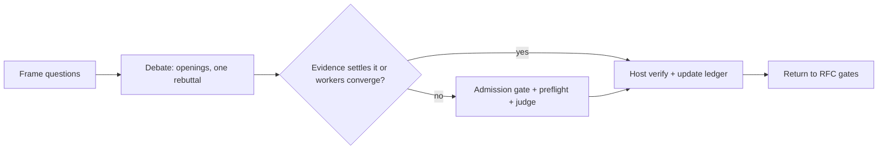

# Optional `clasify` review inside the RFC workflow

Load when, and only when, there is an explicit classification request or experiment admitted by the `octocode-research` clasify gate. That gate owns admission. Ordinary RFC work uses evidence review directly. This optional protocol is not a verified research improvement.

## Availability and budget
- Inspect the Octocode catalog once and check host subagent support. `references/jev-api.md` owns transport, schema discovery, credentials, and results. A catalog entry is not a successful provider call.
- With both capabilities, use exactly two read-only workers. The host submits their arguments through `clasify` to the Jev API.
- If a capability is missing or fails, continue evidence collection and the host completeness audit. Label coverage `unjudged` or `partial` and keep blockers. Do not impersonate agents or claim a judgment that did not run.
- Default budget: two workers, one opening and one rebuttal each, one question group, one judge call, ten minutes. Record a different budget before you start.
- Allow one judgment per unchanged crossroad. Another call needs material new evidence or a changed proposal, plus the action it can change. Stop on exhausted budget, unchanged evidence, or a missing owner decision. Count failed attempts and retries.

## Sequence

Read it as: the judge runs only for a disagreement that evidence and direct checks cannot settle.

1. **Frame.** Use the RFC and ledger from `references/rfc-completeness.md`. Record revision, scope, owner criteria, proposed answer, and deciding evidence. Classify each question: factual, causal, design tradeoff, owner preference, or execution detail. Missing evidence needs collection; owner preferences need owner criteria or a decision.
2. **Debate.** Follow `references/jev-debate.md` for dispatch, barriers, and the frozen packet.
3. **Judge.** Save the host's intended next action. Run `node scripts/validate-debate.mjs request.json worker-packet.json` from this skill folder before submission. Jev assesses the supplied claim or plan; calling it does not improve accuracy by itself.
4. **Verify.** Inspect the deciding evidence or run the selected check. Apply the closure rules in `references/rfc-completeness.md`. Record the API result apart from the host disposition. Changed sources or criteria reopen affected questions. Votes, confidence, and agreement never establish facts or owner acceptance.
5. **Return.** Keep Draft while any decision blocker remains. Continue through `references/workflow.md`. Review does not authorize implementation.

## Receipts and delivery
Store raw dispatches, both worker rounds, exact requests and results, revision or hash, requested model, provider-resolved models, page-local coverage, usage, elapsed time, and host checks under `<output>/octocode-rfc-generator/{name}/review/`. Use the scratch directory for temporary packets. Write the cost receipt from `references/review-cost.md`. Keep transcripts outside the RFC and credentials out of all receipts. Chat-only work stays in chat.
Deliver changed answers, decisive evidence, remaining questions with owners and next checks, dissent, actual judge coverage, and measured cost. State what the review changed relative to the saved pre-call action: discovery, prioritization, or confirmation. "No demonstrated help" is valid. Provider availability, a passing preflight, and host verification are separate claims.

## Sources
These are attributions, not runtime dependencies. `octocode-research` (clasify gate: admission, one call per crossroad, credentials), `octocode-subagent` (worker packets, barriers, parent verification), `octocode-eval-benchmark` (frozen baselines, held-out outcomes, whole-workflow cost), and the [Jev documentation index](https://docs.typesafe.ai/llms.txt) for provider semantics. Native Octocode owns transport, paging, and typed validation.

Next: return to `references/workflow.md` for the RFC gates and delivery.
