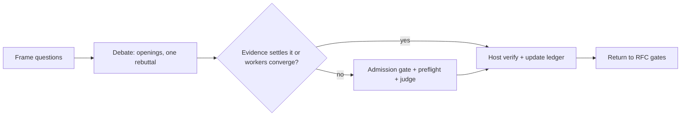

# Optional `clasify` review inside the RFC workflow

Load when an admitted classification request needs the review protocol. Why: this path is optional, and a missing capability stays an unjudged audit. It is not a verified research improvement.

## Availability and budget
- Inspect the Octocode catalog once and check host subagent support. `references/jev-api.md` owns transport, schema discovery, credentials, and results. A catalog entry is not a successful provider call.
- With both capabilities, use exactly two read-only workers. The host submits their arguments through `clasify` to the Jev API.
- If a capability is missing or fails, label coverage `unjudged` or `partial` and keep blockers. Do not impersonate agents or claim a judgment that did not run.
- Default budget: two workers, one opening and one rebuttal each, one question group, one judge call, ten minutes. Record a different budget before you start.
- Allow one judgment per unchanged crossroad. Another call needs material new evidence or a changed proposal, plus the action it can change. Stop on exhausted budget, unchanged evidence, or a missing owner decision. Count failed attempts and retries.

## Sequence

Read it as: the judge runs only for a disagreement that evidence and direct checks cannot settle.

1. **Frame.** Use the RFC and ledger from `references/rfc-completeness.md`. Record revision, scope, owner criteria, proposed answer, and deciding evidence. Classify each question: factual, causal, design tradeoff, owner preference, or execution detail. Missing evidence needs collection; owner preferences need owner criteria or a decision.
2. **Debate.** Follow `references/jev-debate.md` for dispatch, barriers, and the frozen packet.
3. **Judge.** Map the unresolved object through `references/jev-api.md`. Jev assesses the supplied claim or plan; it need not pick a winning speaker, and both arguments can be wrong.
4. **Verify.** Inspect the deciding evidence or run the selected check. Apply the closure rules in `references/rfc-completeness.md`.
5. **Return.** Keep Draft while any decision blocker remains. Continue through `references/workflow.md`. Review does not authorize implementation.

## Receipts and delivery
Store raw dispatches, both worker rounds, exact requests and results, revision or hash, requested model, provider-resolved models, availability/transport outcome, page-local coverage, usage, elapsed time, host checks, and ledger changes under `<output>/rfc/{name}/review/`. Use the scratch directory for temporary packets. Write the cost receipt from `references/review-cost.md`. Keep transcripts outside the RFC and credentials and hidden reasoning out of all receipts. Chat-only work stays in chat.
Deliver changed answers, decisive evidence, remaining questions with owners and next checks, dissent, actual judge coverage, and measured cost. Include the contribution record from `references/jev-debate.md`. Provider availability, a passing preflight, and host verification are separate claims.
