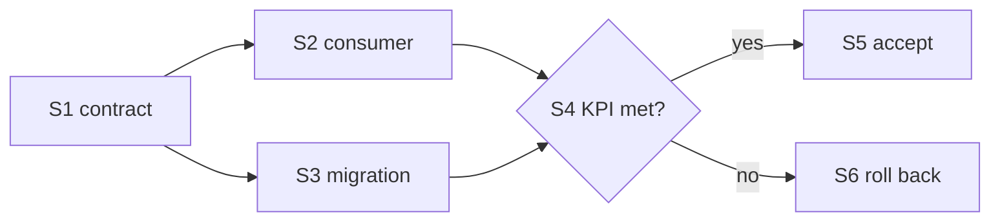

# Diagrams in RFCs

Load when a section explains a flow, structure, comparison, proportion, lifecycle, or schedule. Why: the diagram type and the section heading must name the same fact. Prose carries the evidence.

## Rules

- **One message per diagram.** If you cannot state the message, drop the diagram.
- **True data, drawn to scale.** Every number traces to a cited source. Mark computed or estimated figures.
- **Readable:** show one decision or relationship. Split big pictures into an overview plus details. Label every non-obvious edge.
- **Same names** as the code, schema, and tables (tool names, `S1`, `Q1`).
- **Beta types may not render.** When the argument rests on a `*-beta` chart, also give its numbers in a table.
- **No decoration:** no diagram that restates one sentence, no meaningless colors.

## Type per purpose

| Type (keyword) | Use for | Section heading |
|---|---|---|
| `flowchart` (`subgraph`) | decision trees, data or control flow, plan-step DAG, boundaries | Rationale and Alternatives; Reference-Level Explanation; Steps |
| `sequenceDiagram` (`zenuml` if the team uses it) | protocols, retries, handoffs, continuation walks | Reference-Level Explanation |
| `stateDiagram-v2` | lifecycles, legal and illegal transitions | Reference-Level Explanation |
| `classDiagram` / `erDiagram` | types and ownership / storage entities, keys, migrations | Reference-Level Explanation |
| `C4Context` / `C4Container` / `C4Component` / `architecture-beta` | system, container, and service topology | Motivation and Current State; Reference-Level Explanation |
| `block-beta` / `packet-beta` | layered layouts / wire and bit formats | Reference-Level Explanation |
| `requirementDiagram` | requirement to design to test traceability | Traceability |
| `xychart-beta` | before and after metrics, trends, a target line | Motivation and Current State; Success Metrics |
| `pie` / `sankey-beta` / `treemap-beta` | one total's composition / split-and-merge flows / hierarchical size | Motivation and Current State |
| `quadrantChart` / `radar-beta` | options on 2 criteria / on 4–8 criteria | Rationale and Alternatives |
| `gantt` | only with committed dates or durations; otherwise a flowchart DAG | Steps |
| `timeline` / `gitGraph` | incident or decision history / branch, release, rollback strategy | Prior Art; Rollout, Migration, and Rollback |
| `journey` / `mindmap` | user or agent steps with friction scores / scope and non-goals | Motivation and Current State; Goals and Non-Goals |
| `kanban` | status snapshot (rare; prefer the plan table) | Steps |

## Starter shapes

Replace every label and number with the RFC's own names and data. Plan steps as a DAG that mirrors each step's `Depends on:` field:

A measured series against a target: `xychart-beta` with `title "p95 latency (ms), lower is better"`, `x-axis [baseline, S2, S3, final]`, `y-axis "ms" 0 --> 400`, `bar [380, 260, 210, 190]`, `line [200, 200, 200, 200]`.

Review diagram meaning, source data, and scales; rendering alone proves none of them.

Next: return to the section being drafted in the [single-file RFC](../output.md#structure).
