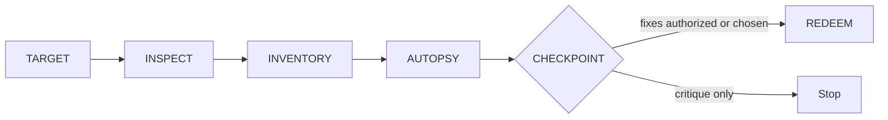

# Octocode Roast

Critique code sharply; prove each finding and give a repair path.

## Rules

- Punch the code, not the coder: no insults about ability, identity, or experience.
- Cite or drop it: every major finding needs an exact anchor, mechanism, impact, confidence, and repair move. Pattern-only matches stay leads with stated confidence.
- Use explicit user targets first; widen to diff/repo scope only when no target exists or the user approves.
- Never reveal a secret; redact values and keep security or production-sensitive findings restrained.
- Rank by demonstrated impact and confidence: security, data loss, correctness, and user-visible performance outrank maintainability and taste.
- Match the requested tone; savage/nuclear language only on explicit request. A critique request returns findings; a request that includes fixes authorizes scoped repairs. Ask only about effects outside that scope.
- Report a missing target or evidence gap without inventing findings. Verify authorized repairs with the target project's relevant checks.

## Resources

Load the page that answers the current question.

| When needed | Read |
|---|---|
| When the target is clear: phases, finding shape, output order | [roast-playbook](references/roast-playbook.md) |
| When a monorepo or many independent categories | [parallel-roasting](references/parallel-roasting.md) |
| For severity labels, language leads | [sin-catalog](references/sin-catalog.md) |
| When repairs are chosen | [redemption-flow](references/redemption-flow.md) |

## Related skills

- `octocode-research`: Use to verify each significant finding.
- `octocode-clean-agentic-code`: Use when the user authorizes behavior-preserving cleanup.

## Output

See [output.md](output.md) for the response and saved-artifact format.
