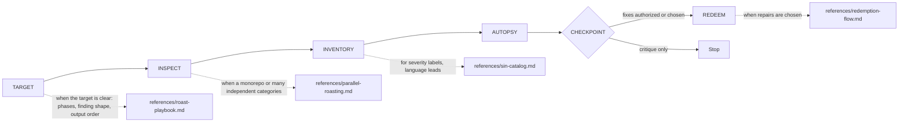

# Octocode Roast

tools: `npx octocode` / `octocode-mcp`
related-skill: `octocode-clean-agentic-code`
output: `<workspace>/.octocode/` for workspace work | `<home>/.octocode/` when no workspace applies

Critique code sharply; prove each finding and give a repair path.

Skill map: CHECKPOINT is the consent gate; dotted edges load a reference.

Reports: `<output>/octocode-roast/`; scratch: `<output>/tmp/octocode-roast/`. Chat-only critiques stay in chat; approved source edits keep their named paths.

## Rules
- Punch the code, not the coder: no insults about ability, identity, or experience.
- Cite or drop it: every major finding needs an exact anchor, mechanism, impact, confidence, and repair move. Pattern-only matches stay leads with stated confidence.
- Use explicit user targets first; widen to diff/repo scope only when no target exists or the user approves.
- Never reveal a secret; redact values and keep security or production-sensitive findings restrained.
- Rank by demonstrated impact and confidence: security, data loss, correctness, and user-visible performance outrank maintainability and taste.
- Match the requested tone; savage/nuclear language only on explicit request. Do not edit or install before consent.
- Stop when the target resolves to no files, a repair or scope expansion needs consent, or evidence cannot support the claimed impact.

## Routes
- Evidence comes from `octocode-research`; if unavailable, use `octocode-mcp` / `npx octocode` and mark reduced coverage. `octocode-eval-benchmark` measures usefulness, `octocode-agentic-prompts` handles wording, `octocode-skills` owns changes to this folder. No scripts: verification runs the target project's own checks.
