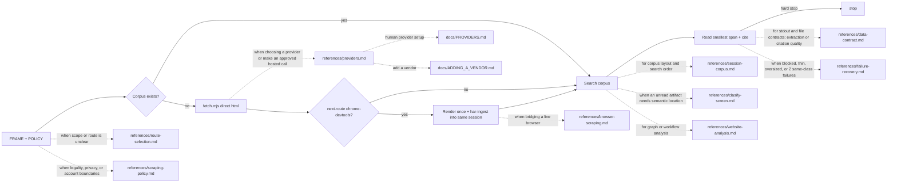

# Octocode Scraping

tools: `npx octocode` / `octocode-mcp`
related-skill: `octocode-chrome-devtools`
output: `<workspace>/.octocode/` for workspace work | `<home>/.octocode/` when no workspace applies

Caption: search before refetching; escalate to a browser only on evidence; stop at the first hard stop; dotted edges load a page in `references/` or `docs/`.

Corpora/runs: `<output>/tmp/scrape/`; reports: `<output>/octocode-scraping/`. Chat answers stay in chat; approved source/config edits keep their paths.

Frame URL/domain, goal, depth, and output before fetching. Default to one public URL, `--mode html`, no explicit provider (bounded direct HTTP), `.octocode/tmp/scrape/{sessionId}`, and compact stdout. **CDP escalation:** when the result has `next.route: octocode-chrome-devtools` (blocked or thin application shell), or target text stays absent after checking wording and extraction quality, load `octocode-chrome-devtools`, render that URL once with `open-browser + page-snapshot + dom-operations-check`, then bridge with `scripts/har-ingest.mjs --session-dir <existing-session> --from-cdp-dir <run>`. Do not start a new scrape session. Live interaction belongs to `octocode-chrome-devtools`.

**Context gate:** query metadata and exact text first. When an unread saved artifact needs semantic location and a small direct read does not decide, use `references/clasify-screen.md`; the `octocode-research` clasify gate owns admission and result rules.

For repo, package, or code claims, use `octocode-research`. Keep URL fetching and corpus extraction in this skill.

Ask before auth, cookie/profile transfer, hosted spend, anti-bot escalation, crawl expansion (depth, max pages, rate), CAPTCHA/MFA, personal-data export, form submits, purchases, sends, deletes, or account changes. Stop after two same-class failures, a hosted `403`, an auth/challenge gate, one failed CDP escalation, or enough saved evidence. Stop before expanding a crawl whose summary is not yet useful. Cite artifact paths plus URL metadata, never raw dumps.

## Route

- When fetching/crawling/extracting, run `scripts/fetch.mjs --url <u> [--mode html] [--crawl --same-domain --max-pages <n>] [--no-raw]`; when a brief is also needed, run `scripts/fetch-and-brief.mjs --url <u>`.
- Before routing/spend → `scripts/provider-check.mjs [--provider 
]`; credit status → `scripts/provider-usage.mjs`. Both sanitize secrets.
- When navigating a saved session, run `scripts/corpus-inspect.mjs --session-dir <d> [--page <n>]`; for bounded text search, run `scripts/corpus-find.mjs --session-dir <d> --query <t>`. Retrieve the smallest sufficient source span.
- When querying static DOM/assets/paths, run `scripts/dom-find.mjs`, `scripts/resource-list.mjs`, or `scripts/graph-navigate.mjs` with `--session-dir <d>`.
- Local field proof → `scripts/corpus-run.mjs --session-dir <d> --roots cdp,extracts --regex <re>` or `--script <file>`.
- When handing a corpus to a live browser, run `scripts/har-ingest.mjs --session-dir <d> --export-packet`.
- When field names are unclear, run `scripts/schema-helper.mjs --intent "extract pricing and features"`.
- When an old transcript names `scripts/scrapingant-fetch.mjs`, `scripts/scrapingant-check.mjs`, or `scripts/scrapingant-usage.mjs`, treat them as forwarding shims and use the neutral scripts above.

Every runnable script accepts `--help`. Before changing scripts or providers, read `scripts/README.md`; shared modules live in `scripts/lib/`, vendored env resolution in `scripts/octocode-config.mjs`, and JSON contracts in `scripts/schemas/`.

After corpus-search changes, run `node --test scripts/tests/corpus-find.test.mjs`; after fetch/session changes, run `node --test scripts/tests/fetch-session.test.mjs`; after robots/pacing/body-cap changes, run `node --test scripts/tests/http-policy.test.mjs`; after CDP client changes, run `node --test scripts/tests/cdp-client.test.mjs`. These finite local regressions need no browser or hosted provider; they do not replace a live browser check for CDP integration changes.
