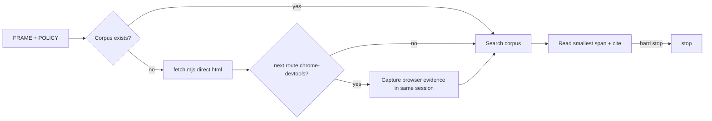

# Octocode Scraping

Verify facts in retained source text. Establish the URL/domain, goal, scope, and output from the request. For an unspecified scope, start with one public URL, `--mode html`, bounded direct HTTP, and compact stdout. Sessions are saved in `.octocode/tmp/scrape/{sessionId}`.

When output routes to `octocode-chrome-devtools`, or missing text points to a rendering gap, capture the needed browser evidence. Bridge it with `scripts/har-ingest.mjs --session-dir <existing-session> --from-cdp-dir <run>` so the evidence stays in the same corpus. Use the Chrome skill for live interaction.

**Context gate:** query metadata and exact text first. When an unread saved artifact needs semantic location and a small direct read does not decide, use `references/clasify-screen.md`; the `octocode-research` clasify gate owns admission and result rules.

For repo, package, or code claims, use `octocode-research`. Keep URL fetching and corpus extraction in this skill.

The optional hosted provider needs `SCRAPING_ANT`; set it in `<HOME>/.octocode/.env` if used. Direct public fetching needs no key. Never print the value.

Use the user's existing authorization for collection and browser actions. Ask only when a new effect exceeds it, such as paid usage, account access, data export, or a wider crawl. Respect authentication challenges, robots policy, server pacing, and provider hard stops. Retry when a changed diagnosis or input can help within the task budget; repeated identical failures need a new approach. Stop collecting once the evidence answers the task. Cite artifact paths and source URLs.

## Route

- When fetching or crawling, run `scripts/fetch.mjs --url <u> [--mode html] [--crawl --same-domain --max-pages <n>] [--no-raw]`; inspect the saved session when a brief is needed.
- Check a hosted provider with `scripts/provider-check.mjs` before using it; `scripts/provider-usage.mjs` reports credits. For a saved session, start with `scripts/corpus-inspect.mjs --session-dir <d>` or `scripts/corpus-find.mjs --session-dir <d> --query <t>`.
- Choose navigation candidates from observed labels, destination URLs, scores and source evidence. Read the deciding source, then fetch the selected allowed URL or hand interaction to Chrome. After each transition, update the graph from fresh evidence; ranking is a hint, not permission to submit a form.
- When a query has more results, follow each executable `next.*` query continuation; `scripts/source-query.mjs` pages original JSON, text or binary bytes. Oversized query values carry full-value continuations.
- For specific corpus work, use `scripts/dom-find.mjs` (DOM), `scripts/resource-list.mjs` (assets), `scripts/graph-navigate.mjs` (links), `scripts/corpus-run.mjs` (local proof), or `scripts/har-ingest.mjs` (browser handoff). Choose extraction fields from the actual question and verify them in saved source text.

Every runnable script accepts `--help`. Before changing scripts or providers, read `scripts/README.md`; shared modules live in `scripts/lib/`, and JSON contracts in `scripts/schemas/`.

Run the tests in `scripts/tests/` that cover changed behavior. A CDP integration change also needs a live browser check.

## Resources

Load the page that answers the current question.

| When needed | Read |
|---|---|
| When scope or route is unclear | [route-selection](references/route-selection.md) |
| When legality, privacy, or account boundaries | [scraping-policy](references/scraping-policy.md) |
| When choosing a provider or make an approved hosted call | [providers](references/providers.md) |
| Human provider setup | [PROVIDERS](docs/PROVIDERS.md) |
| Add a vendor | [ADDING_A_VENDOR](docs/ADDING_A_VENDOR.md) |
| When bridging a live browser | [browser-scraping](references/browser-scraping.md) |
| For corpus layout and search order | [session-corpus](references/session-corpus.md) |
| When an unread artifact needs semantic location | [clasify-screen](references/clasify-screen.md) |
| For graph or workflow analysis | [website-analysis](references/website-analysis.md) |
| For stdout and file contracts; extraction or citation quality | [data-contract](references/data-contract.md) |
| When blocked, thin, oversized, or repeatedly failing | [failure-recovery](references/failure-recovery.md) |

## Related skills

- `octocode-chrome-devtools`: Use when rendering or interaction requires a live browser.
- `octocode-research`: Use when the fetched material supports a code or package claim.

## Output

See [output.md](output.md) for the response and saved-artifact format.
