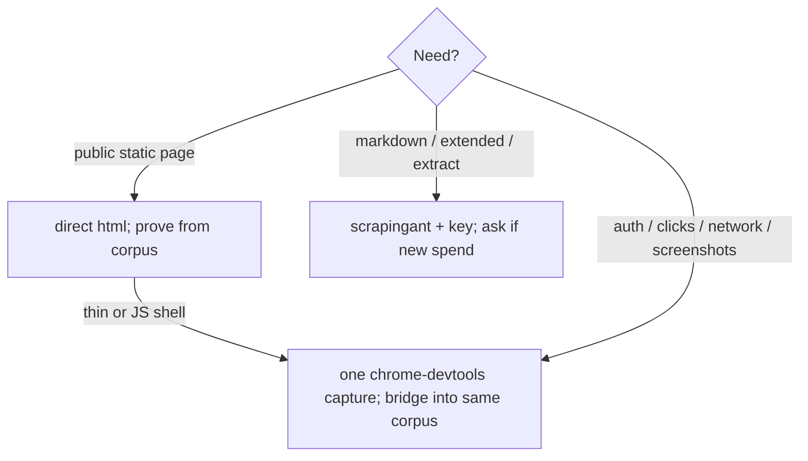

# Scope and route selection

Load before a broad crawl, an extract schema, or workflow analysis, or when the fetch route is unclear. Better inputs give smaller corpora; the cheapest route that can prove the claim wins.

## Ask
Goal · scope (one URL / list / same-domain max-pages) · output shape · evidence strictness · boundaries (auth, personal data, forms, CAPTCHA, rate limits).

Vague request: apply the lobby defaults, no auth, no broad crawl; return the session path and the next search targets.

## Route tree
Installing chrome-devtools never changes the default, and `SCRAPING_ANT` never auto-selects.

One route per need. Site or workflow mapping uses a bounded `--crawl --same-domain --max-pages`.

Next: for the vendor registry and hosted mechanics load `references/providers.md`; when boundaries or legality are unclear load `references/scraping-policy.md`; when the route fails load `references/failure-recovery.md`.
