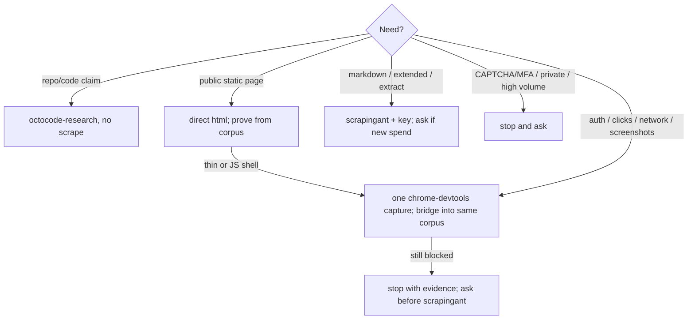

# Scope and route selection

Load before a broad crawl, an extract schema, or workflow analysis, or when the fetch route is unclear. Better inputs give smaller corpora; the cheapest route that can prove the claim wins.

## Ask
Goal · scope (one URL / list / same-domain max-pages) · output shape · evidence strictness · boundaries (auth, personal data, forms, CAPTCHA, rate limits).

Vague request: one public URL, `--mode html`, omit `--provider`, no auth, no broad crawl, session `.octocode/tmp/scrape/{sessionId}`. Return the session path and the next search targets. Markdown and ScrapingAnt are never the default.

## Route tree
Omitting `--provider` on html gives bounded `direct`. Installing chrome-devtools never changes this default. `SCRAPING_ANT` never auto-selects. Check routes with `provider-check.mjs`.

One route per need; escalate only on evidence, never on installation.

| Intent | Route |
|---|---|
| fetch/scrape page | `--mode html` (omit `--provider`) |
| pretty markdown | ask: needs scrapingant + key |
| structured fields | ask: `--mode extract` (hosted) |
| site/workflows | bounded `--crawl --same-domain --max-pages` |
| live click / HAR / perf | chrome-devtools (`references/browser-scraping.md`) |

Fetch one URL first. Expand a crawl only after `reports/summary.md` is useful. Cite `text/`, `extracts/`, `cdp/` plus `sources.jsonl`.

Next: for the vendor registry and hosted mechanics load `references/providers.md`; when boundaries or legality are unclear load `references/scraping-policy.md`; when the route fails load `references/failure-recovery.md`.
