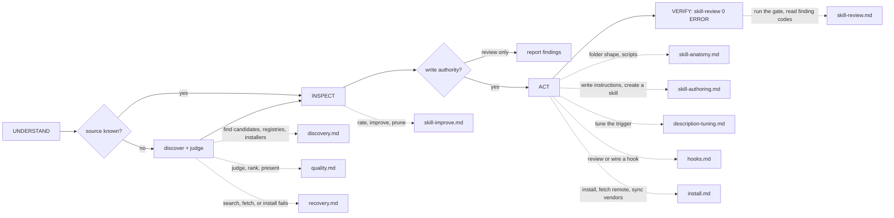

# Octocode Skills

tools: `npx octocode` / `octocode-mcp`
related-skill: `octocode-research`
output: `<workspace>/.octocode/` for workspace work | `<home>/.octocode/` when no workspace applies
routes: load/run a reference, doc, script, or scheme only when it changes the next action; otherwise keep the rule here.

Manage standalone Agent Skill folders: `SKILL.md` plus optional references, scripts, assets, and JSON schemes.

Flow: `UNDERSTAND → INSPECT → ACT → VERIFY`.

Caption: discover only when the source is unresolved; review-only requests never edit; each dotted edge names the trigger that loads that `references/` page.

Reviews go to `<output>/octocode-skills/`; scratch to `<output>/tmp/octocode-skills/`. Chat-only recommendations stay in chat. Approved edits, installs, symlinks, and config keep their gated destinations.

## Rules
- UNDERSTAND: name the operation, scope, source, and write authority. Ask only for missing scope or authority.
- INSPECT the real skill before you quote, judge, or install it. Identify candidates by path.
- Stop discovery when one fit is clear, more angles add no evidence, a winner needs user judgment, or approval is pending.
- ACT: ship a standalone folder. Every local reference stays inside it; every shipped file is reachable and used. Core commands work alone; optional sibling integrations declare setup and pass absent/present checks.
- VERIFY: run `scripts/skill-review.mjs` after any create or edit; zero ERRORs must pass.

## Pages
Load on the map trigger: `references/discovery.md` · `references/quality.md` · `references/recovery.md` · `references/skill-improve.md` · `references/skill-anatomy.md` · `references/skill-authoring.md` · `references/description-tuning.md` · `references/hooks.md` · `references/install.md` · `references/skill-review.md`. Hooks use `assets/hooks/`; measure behavior changes with `octocode-eval-benchmark`.

Related: `octocode-research` verifies candidates; `octocode-prompt-optimizer` improves wording; `octocode-rfc-generator` precedes a large skill-system redesign.

## Scripts
- `scripts/skill-review.mjs`: the review gate after any create or edit. `scripts/skill-lint.mjs` is an alias.
- `scripts/skill-sync.mjs`: run after you read its dry-run and existing authority covers source, destinations, and conflict policy.
- A skill script that needs Octocode home or env imports `./octocode-config.mjs`, which `packages/octocode-config` injects at build. Never import `@octocodeai/config` from a skill.
- To wire a hook, copy `assets/hooks/example-hook.sh` into the target skill's hook directory and route it from frontmatter.
