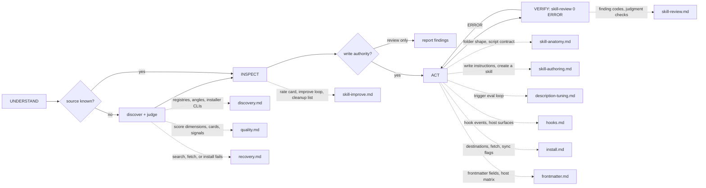

# Octocode Skills

tools: `npx octocode` / `octocode-mcp`
related-skill: `octocode-research`
output: `<workspace>/.octocode/` for workspace work | `<home>/.octocode/` when no workspace applies

Manage standalone Agent Skill folders: `SKILL.md` plus optional references, scripts, assets, and JSON schemes. Not for code logic another skill owns, open ideation (`octocode-brainstorming`), or code architecture (`octocode-architect`).

Flow: `UNDERSTAND → INSPECT → ACT → VERIFY`.

Caption: discover only when the source is unresolved; review-only requests never edit; each dotted edge names the trigger that loads that `references/` page.

## UNDERSTAND
- Name the operation, scope, source, and write authority. Ask only for missing scope or authority.
- Mode: rate or review = score and report, no edits. Improve or create = inspect, patch, verify. Apply prior findings = reuse this conversation's rating.
- An authorized create or edit request needs no second approval.

## Discover and judge (source unresolved)
- Depth: quick = one best candidate with caveats; research = compare broadly, cross-check two or more surfaces; install = inspect source, support files, destinations, and conflicts before approval.
- Surfaces in order: Octocode/GitHub through `octocode-research`, the skills.sh API, then web search. Local or org-private scope: Octocode only. Dedupe by `(owner/repo, skill name)`.
- Stop when one fit is clear, more angles add no evidence, a winner needs user judgment, or approval is pending.
- Inspect a real `SKILL.md` before you quote, judge, recommend, or install it. Identify candidates by path.
- Content fit decides (`High` / `Medium` / `Low`); adoption signals only break ties. Never recommend the top install blindly.
- Present: lead with one recommendation sentence, compact cards, no raw search dumps, then `Next: install | adapt locally | compare | inspect further | stop`.
- A failed surface: broaden once, then report the gap. Never invent candidates. Unsafe commands, hidden network, or unclear license: do not recommend install.

## INSPECT
- Read the target `SKILL.md` and local example skills, inventory its files, and read every file the change touches. Never rewrite from a summary.
- Run `node scripts/skill-review.mjs <skill-dir>` before you judge.

## ACT: authoring rules
- Ship a standalone folder. Every local reference resolves inside it; every shipped file is reachable and used. Core commands work alone; an optional sibling integration declares setup and passes absent and present checks.
- Lobby = full picture: the skill map plus every gate, stop condition, consent rule, threshold, default, and key phase rule, one line each. References hold detail only. Lobby 150 lines or fewer.
- At most 12 reference pages, each 100 lines or fewer, each opening with `Load when … Why: …`. Merge pages that serve one decision.
- Lobby convention below the H1: `tools:`, `output:` (or none); `routes:` only without a skill map; `related-skill:` only when useful.
- Write in STE-80. Show a flow, branch, or loop as one Mermaid diagram (12 nodes or fewer) plus a caption; keep commands, thresholds, and paths as text.
- Pick one default; give alternatives only as escape hatches. Use exact commands for fragile, destructive, or order-dependent steps.
- `description`: what the skill does and when to use it, as one `Use when` sentence of user intents (house rule). 1024 chars or fewer, trigger in the first ~50 chars, no "I" or "you", no mandate words. Hard rules go in the lobby body.
- `name`: 64 chars or fewer, `a-z0-9` with single hyphens, equal to the folder, no `anthropic` or `claude`. Publish only spec fields; host extras stay host-local.
- Move deterministic procedure into `scripts/`: flags not prompts, `--help`, stdout data, `--dry-run` for stateful work, meaningful exit codes.
- A skill folder is never an artifact root. Ask before you delete a non-empty file when unsure.

## ACT: install, sync, hooks
- Normalize the source; the name is the final folder segment. A frontmatter `name` mismatch: surface it and ask.
- Read third-party scripts and hooks before any write. Check each destination; on conflict choose Overwrite / Skip / Rename / Diff / Cancel. Never overwrite silently.
- Install: `npx -y octocode skill install --add <src> --platform <hosts>`, then `test -f <dest>/<skill-name>/SKILL.md` and give a reload hint.
- Fetch writes by copy only, never symlink. Copy wholesale only with a license and user approval. Partial download: re-fetch once, then stop.
- Symlink only a stable local source that someone edits live. `scripts/skill-sync.mjs` dry-runs by default; read the plan before `--approve`; `--force` needs `--approve`.
- Hooks: confirm the host runs the surface; always set `timeout`; use `${CLAUDE_SKILL_DIR}` only in Claude skill frontmatter; to wire one, copy `assets/hooks/example-hook.sh`.

## VERIFY
- Run `node scripts/skill-review.mjs <skill-dir>` after any create or edit. 0 ERROR passes; fix each WARN or state why it stays.
- Static review runs no script. With authority, copy the skill alone to a temp directory and run its `--help` and fixture checks from another directory.
- Evaluate first: write three or more eval prompts and run them without the skill (or with the old copy) as the baseline before you write; measure the change with `octocode-eval-benchmark`.

## Output
Reviews go to `<output>/octocode-skills/`; scratch to `<output>/tmp/octocode-skills/`. Authored skills use the same shape: `<root>/<skill-name>/` and `<root>/tmp/<skill-name>/`, with `<home>/.octocode/` only when no workspace applies or the artifact is user-scoped. Chat-only results stay in chat. Approved edits, installs, symlinks, and config keep their gated destinations. An unwritable root fails clearly; never switch roots silently.

## Scripts
Hooks templates live in `assets/hooks/`.

- `scripts/skill-review.mjs`: run in INSPECT and VERIFY; `--self-test` checks the reviewer. `scripts/skill-lint.mjs` is an alias.
- `scripts/skill-sync.mjs`: sync a local skill to vendor folders after you read its dry-run.
- A skill script that needs Octocode home or env imports `./octocode-config.mjs`, which `packages/octocode-config` injects at build. Never import `@octocodeai/config` from a skill.

Related: `octocode-research` verifies candidates; `octocode-agentic-prompts` improves wording and agent flows; `octocode-rfc-generator` precedes a large skill-system redesign.
