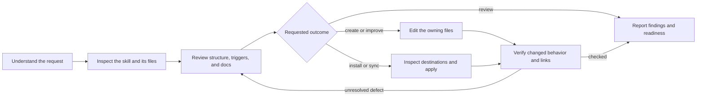

# Octocode Skills

Build skills that an agent can discover, follow, and verify. This file owns the collection's authoring and review standard.

## What belongs in a skill

These are responsibilities, not a fixed template. Use headings and ordering that help the reader; add fields only for a real consumer.

| Component | Purpose and guidance |
|---|---|
| `name` | A stable, recognizable identifier matching the folder. Keep the established name unless the scope changes; avoid names tied to one example or implementation detail. |
| `description` and triggers | Tell agents what the skill helps accomplish and when to use it. Cover related intents with natural phrases such as “Use when…” and “good for…”. Include useful domain terms and varied examples; exact wording is not an activation gate. Keep setup and execution rules in the body. |
| Frontmatter | `name` and `description` are required by the format. Add compatibility, tool permissions, or other host fields only when needed; see [frontmatter](references/frontmatter.md). No invented mandatory metadata. |
| `SKILL.md` lobby | Give the purpose, useful default workflow, decision points, boundaries, verification, and output route. Keep ordinary guidance here; avoid another file for a few bullets. |
| Mermaid | Show the real flow, branches, retries, or handoffs when that makes the skill easier to follow. Label deciding edges. Keep file inventories in a route table instead of turning the diagram into a directory tree. A simple instruction needs no diagram. |
| Supporting files | Keep substantial optional detail in references. Route every reference and runnable script from the lobby with when and why to use it. A linked catalog can group a large set; group internal libraries, schemas, tests, and assets by their consumer. Remove unused files and duplicate guidance. |
| Scripts and hooks | Keep real task logic: fetching, rendering, transformation, or contract checks. Prefer instructions for environment lookup and editorial judgment. Remove thin aliases, fixed-phrase graders, and hooks with no demonstrated event to handle. |
| `output.md` | Explain usable formats and meaningful content, with a single authored artifact when it can serve the task. Keep probe output and process metadata out of deliverables. Require exact fields only for a real downstream contract. |
| Related skills | Name nearby skills in the lobby and explain when and why to use each. Keep the current task's owner clear; handoffs are conditional, not a required chain of skills. |
| `README.md` | A concise human entry point: purpose, when useful, where to start, output, and setup only if needed. Link to the lobby instead of copying its rules. |
| Configuration | Only for a real dependency: name the variables, when required, and `<HOME>/.octocode/.env`. Check presence with `npx octocode config check KEY`; resolve via `npx octocode config get KEY` only when needed and capture secrets without displaying them. `npx octocode config home` finds the configured home. Use the existing CLI or process environment; do not bundle an env reader. |

## Deliver content only

Never add probe output or generated process metadata to user-facing responses or artifacts: no tool transcripts, run or session IDs, receipts, worker rosters, generation timestamps, author/status tables, or research diaries. Keep the requested content, useful rationale, source citations, substantive measurements, and material limitations. Source dates or versions belong only where they establish a fact's applicability.

Tool protocols and internal execution records retain the fields their consumers need; do not copy that bookkeeping into the deliverable. Check output guides, templates, and renderers for automatic additions. Prefer one document with sections when the reader needs one coherent result; extra artifacts need an explicit purpose requested by the user.

## Review and refine

1. Read the target lobby, inventory supporting files, and read the affected docs and executable logic. Discover external candidates only when the source is unresolved; compare actual task fit, evidence, and host support before popularity.
2. Run `node <this-skill>/scripts/skill-review.mjs <skill-or-collection-dir>` for structural findings. Check that shipped files are reachable from the lobby and included in packaging; a local ignored file can hide a broken installation.
3. If available, use `octocode-agentic-prompts` to review descriptions, triggers, ambiguity, conflicting rules, and agent behavior. Use `octocode-documentation` to review the lobby, README, output guide, and supporting docs for clarity, links, examples, and consistent terminology. Apply their guidance within this task; do not recursively restart a skill review.
4. Check activation against realistic requests with varied phrasing, implicit intent, and near-misses that belong to neighboring skills. Fix the intent boundary rather than adding exact keyword exceptions. For measured activation claims, test unused cases through the target host and record misses and false triggers.
5. Edit the smallest owning surface. Reuse the user's existing authorization. A review-only request returns findings; an improvement request includes fixes and verification. Preserve meaningful contracts, useful scripts, and concurrent work.
6. Rerun structural checks and the focused checks for changed executable behavior. Verify commands against live help and preserve standalone installation. Report checks that could not run.

Choose the owner by the requested result: “make this skill discoverable” belongs here; “make this instruction produce the right action” belongs to `octocode-agentic-prompts`; “explain this behavior clearly” belongs to `octocode-documentation`. A task can use all three without repeating their workflows. Treat these as intent examples, not keyword rules.

## Rating

Assess **activation fit, workflow clarity, resource usefulness, output usability, and verification**. Give evidence for each material weakness and the next repair. A useful overall verdict is **ready**, **needs refinement**, or **blocked by a named dependency**; exact labels are optional. Numeric ratings are subjective unless backed by a defined evaluation. Compare the same criteria before and after when rating a refinement.

Lint checks files and structure. Editorial review checks meaning. Host activation tests check actual selection. Keep these conclusions separate; passing one does not prove the others.

## Optional routes

| Need | Resource |
|---|---|
| Find external candidates or choose a discovery surface | [discovery](references/discovery.md) |
| Check portable fields or a host-specific requirement | [frontmatter](references/frontmatter.md) |
| Install, adapt, sync, or handle destination conflicts | [installation](references/install.md) |
| Check local structure and links; `--self-test` checks the checker | [skill-review.mjs](scripts/skill-review.mjs) |
| Link a stable local source into vendor folders; inspect the dry-run before applying | [skill-sync.mjs](scripts/skill-sync.mjs) |

For failed discovery or fetching, inspect the source repository or another available surface and report missing evidence. For install failures, preserve successful destinations and report the failed path. Ask only for an unresolved choice or new authority.

## Related skills

- `octocode-agentic-prompts`: Review descriptions and trigger boundaries, and repair instruction behavior.
- `octocode-documentation`: Check every affected document for clarity, accuracy, and usable structure.
- `octocode-research`: Verify repository evidence and external skill sources.
- `octocode-eval-benchmark`: Measure activation or outcome improvements when a behavioral claim needs evidence.

## Output

Use [output.md](output.md) for review findings, change summaries, and installation results. Keep authored skills in their canonical folders and user artifacts at the requested destination.
