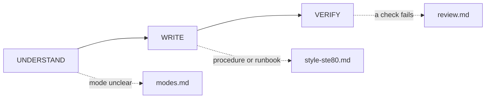

# Skill anatomy

Load when you evaluate, improve, or create a skill's folder shape, or add or review `scripts/`. Why: shape decides what loads and when; code beats agentic prose for mechanical steps.

Name optional sibling skills without file paths.

```text
my-skill/
|-- SKILL.md       # required lobby: frontmatter, flow, gates, routes
|-- README.md      # human overview (review recommends)
|-- references/    # one-concept depth, all reachable
|-- scripts/       # deterministic helpers actually routed
|-- assets/        # templates/resources actually used
`-- scheme/        # optional JSON contracts; one top-level object per file
```

## Progressive disclosure

1. Discovery: the agent sees only `name` + `description` (about 100 tokens per skill).
2. Activation: a matching task loads the full `SKILL.md` (spec: under 5,000 tokens and 500 lines).
3. Execution: the agent loads references and scripts only when a route says so.

Reference detail means catalogs, examples, long procedures, data, and sources. Move a rule up when it decides the next action. Add a second small diagram only for a loop the map cannot show.

`SKILL.md` opens with the skill map: one Mermaid diagram that shows the flow phases (solid edges) and every reference page (dotted edges labeled with the trigger), then a one-line caption. The 12-node cap counts flow nodes only, so every page fits as a leaf.



## References

- Merge pages that serve one moment of use too; do not fragment a coherent procedure.
- Give a next hop only when the procedure depends on another file.
- Put tabular content in a real markdown table.
- A reference earns its hop only when it changes the next action and saves context.

## Navigation

- `SKILL.md` routes every reference directly: one level deep, no chains. A `Next:` hop names only a page the lobby also routes. Do not duplicate one catalog in two places.
- Write relative paths from the skill root with forward slashes (`references/<page>.md`), never `\`.
- A loaded file over 100 lines (asset, catalog, API doc) opens with a table of contents, so a partial read still sees its scope.
- Every flow phase in `SKILL.md` appears in a route or gate.
- Library modules under `scripts/` stay unlisted but imported. Route each `scheme/<contract-name>.json` from its consumer.

Cut test: "Can the agent get this wrong without the skill?" If not, cut it.

## Scripts

A script is more reliable, token-cheap, and identical every run. Use one-off shell only when an existing tool already does the job; pin versions when needed.

Agent-facing contract, beyond the lobby rule:

- `--help` is concise and has examples.
- Errors say what failed, what was expected, what to try. <!-- style-lint: ignore-line passive-voice -->
- Diagnostics go to stderr.
- Idempotent or safe to retry; reject ambiguous input; no interactive prompts.
- The script handles its errors (missing file, bad input) and does not punt them to the agent.
- Each constant states its reason; no magic numbers.
- Dependencies are inline (PEP 723, pinned `npx -y pkg@1.2.3`) or listed in `compatibility`; never assume an install.
- Bounded or paginated output.
- Reference from `SKILL.md` as `scripts/skill-review.mjs` (or the real script name) with when/why, and say "run" or "read": the agent runs most scripts and reads only a reference-style one.

A long numbered command-like procedure in `SKILL.md` with no helper is a candidate to extract; the review flags `deterministic-prose`.

Next: to write instructions, load `references/skill-authoring.md`; if the script is a hook brain, load `references/hooks.md`; before done, load `references/skill-review.md`.
