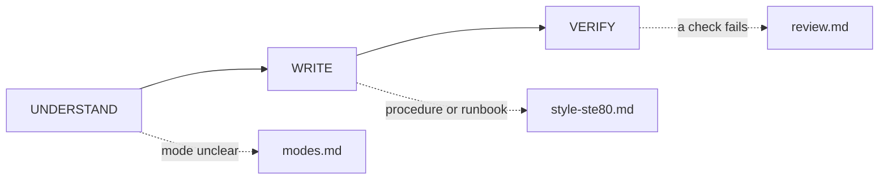

# Skill anatomy

Load when you evaluate, improve, or create a skill's folder shape, or add or review `scripts/`. Why: shape decides what loads and when; code beats agentic prose for mechanical steps.

A skill is one standalone folder. Every local file reference resolves inside it, and every shipped file is used. Name optional sibling skills without file paths.

```text
my-skill/
|-- SKILL.md       # required lobby: frontmatter, flow, gates, routes
|-- README.md      # human overview (review recommends)
|-- references/    # one-concept depth, all reachable
|-- scripts/       # deterministic helpers actually routed
|-- assets/        # templates/resources actually used
`-- scheme/        # optional JSON contracts; one top-level object per file
```

## Progressive disclosure

1. Discovery: the agent sees only `name` + `description`.
2. Activation: a matching task loads the full `SKILL.md`.
3. Execution: the agent loads references and scripts only when a route says so.

`SKILL.md` owns the flow, entry decisions, shared constraints, and routes. It opens with the skill map: one Mermaid diagram that shows the flow phases (solid edges) and every reference page (dotted edges labeled with the trigger), then a one-line caption. Exact commands, thresholds, and paths stay in text.



## References

- Keep 12 reference pages or fewer, each 100 lines or fewer. Merge pages that serve one decision or one moment of use; do not fragment a coherent procedure.
- Open with `Load when … Why: …` so the route is verifiable from the file itself.
- Give a next hop only when the procedure depends on another file.
- Put tabular content in a real markdown table.
- A reference earns its hop only when it changes the next action and saves context. Move a short shared rule into the lobby.

## Navigation

- `SKILL.md` routes main capabilities. A used reference can route deeper files; do not duplicate one catalog in two places.
- Every flow phase in `SKILL.md` appears in a route or gate.
- Library modules under `scripts/` stay unlisted but imported. Route each `scheme/<contract-name>.json` from its consumer.

Cut test: "Can the agent get this wrong without the skill?" If not, cut it.

## Scripts

### Why scripts

A script is more reliable, token-cheap, and identical every run.
Reserve prose for judgment; hand procedure to `scripts/`.
Use one-off shell only when an existing tool already does the job; pin versions when needed.

### Agent-facing contract

- Input through flags, env, files, or stdin — never interactive prompts.
- Concise `--help` with examples.
- Errors say what failed, what was expected, what to try. <!-- style-lint: ignore-line passive-voice -->
- Structured data on stdout; diagnostics on stderr.
- Idempotent or safe to retry; reject ambiguous input.
- `--dry-run` for destructive/stateful ops.
- Meaningful exit codes; bounded or paginated output.
- Reference from `SKILL.md` as `scripts/skill-review.mjs` (or the real script name) with when/why.

### When to extract

Move complex or repeatedly reinvented logic into `scripts/`. If `SKILL.md` has a long numbered command-like procedure with no helper, extract it — the review flags `deterministic-prose`.

Next: to write instructions, load `references/skill-authoring.md`; if the script is a hook brain, load `references/hooks.md`; before done, load `references/skill-review.md`.
