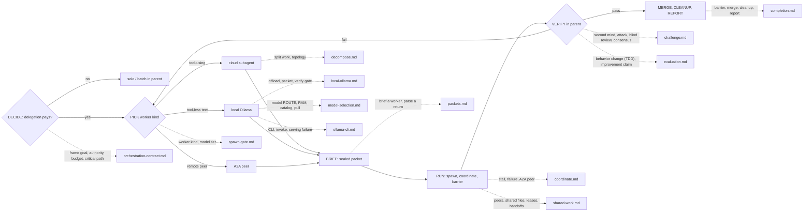

# Octocode Subagent
tools: `npx octocode` / `octocode-mcp`
related-skill: `octocode-research`
output: `<workspace>/.octocode/` for workspace work | `<home>/.octocode/` when no workspace applies
routes: load/run a reference, doc, or script only when it changes the next action; otherwise keep the rule here.
The parent owns user intent, authority, user contact, integration, irreversible actions, evidence, and the final verdict, unless an explicit handoff transfers contact within the same authority ceiling. Workers return bounded claims, never authority. Write packets and results to `<output>/worker/` and transient prompts to `<output>/tmp/ollama-worker/`. Chat-only synthesis stays in chat; approved source edits keep their paths.

Caption: default solo; dotted edges load a page in `references/`; every worker result passes parent VERIFY before merge.
## Rules
1. Frame substantial work before fan-out. Never broaden intent, permissions, effects, deletion scope, or budget because this skill is active.
2. Spawn only when delegation improves speed, expertise, isolation, or context quality. Otherwise work solo; batch known independent reads.
3. Give each worker one bounded objective. No nested spawn unless the host allows it and a new value/cost gate passes.
4. Check what context the worker inherits. Add only the missing goal, scope, evidence, authority, ownership, and acceptance.
5. Treat worker output as claims. Re-check load-bearing anchors in the parent; always VERIFY Ollama output. Reach the worker barrier before synthesis; keep `partial`, `blocked`, conflicts, and dissent visible.
6. Use the requested model or the host default; else pick a capable configured model. Challenge techniques use fresh context; agreement is not proof. Local Ollama is tool-less one-shot or map-reduce only.
7. Stop when acceptance is met or progress needs missing authority or information. Completed workers trigger parent verification; an empty worker list does not mean done.
Pages (load each when its map edge fires): `references/orchestration-contract.md` · `references/spawn-gate.md` · `references/decompose.md` · `references/packets.md` · `references/coordinate.md` · `references/shared-work.md` · `references/challenge.md` · `references/evaluation.md` · `references/completion.md` · `references/local-ollama.md` · `references/model-selection.md` · `references/ollama-cli.md` · `references/references.md` (orchestration sources).
Related: `octocode-eval-benchmark` measures worker quality and this skill; `octocode-rfc-generator` before multi-agent architecture changes; `octocode-prompt-optimizer` for packet contracts; `octocode-skills` for this folder.
Scripts: at GATE and after model ROUTE, run `scripts/ollama-health.sh`; at RUN, run `scripts/ollama-worker.sh` once per sealed packet or shard with `--job`, `--input`, `--schema`, `--out`, and `--keepalive`. After changing tool-using orchestration, run `scripts/eval-contract.mjs`. It validates `evals/cases.json`; `--results` grades only a fresh current-digest receipt kept outside the shipped skill.
